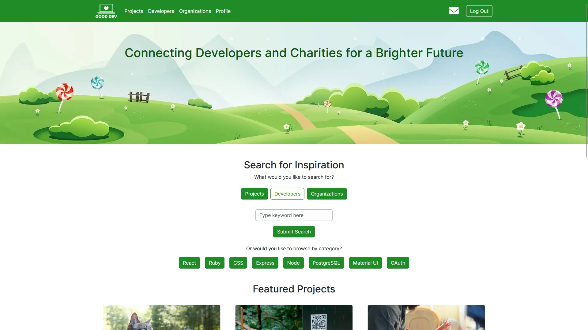
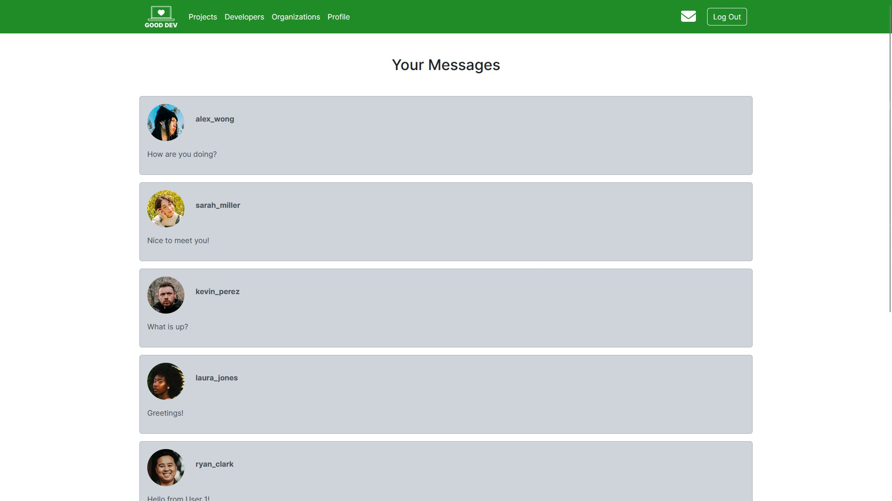
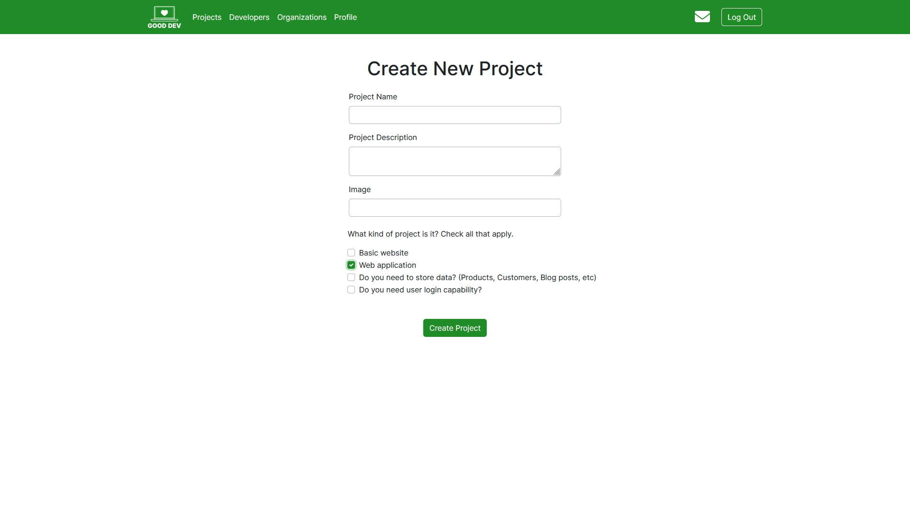

# Good Dev
 Good Dev is an application that connects developers in Canada with non-profit organizations and charities in need of software development services on a volunteer basis. 

 This was done for our final project of Lighthouse Labs.

 Some features of Good Dev:
 + Account creation for developers and organizations.
 + Organizations can post projects.
   + It is a simple system for organizations who may not be familiar with technology stacks.
 + Developers can apply to work on projects
 + Project owners can post updates on projects.
 + Users can message each other.
 + There is a tag system to sort developers and projects.
   + Tags consist of parts of a technology stacks.
     + For example: react or ruby.
   + Tags represent your skills as a developer or what skills you need as a project.
 + Users can search projects and developers by tag or search term.
 + Users can search organizations by search term.
 + The quick search function will automatically sort developers for projects based on how many tags they have in common.
    + Developers have the same feature but to sort projects.

## Photos

## Client Commands
npm run dev 

## Server Commands
npm run start

npm run-script reset